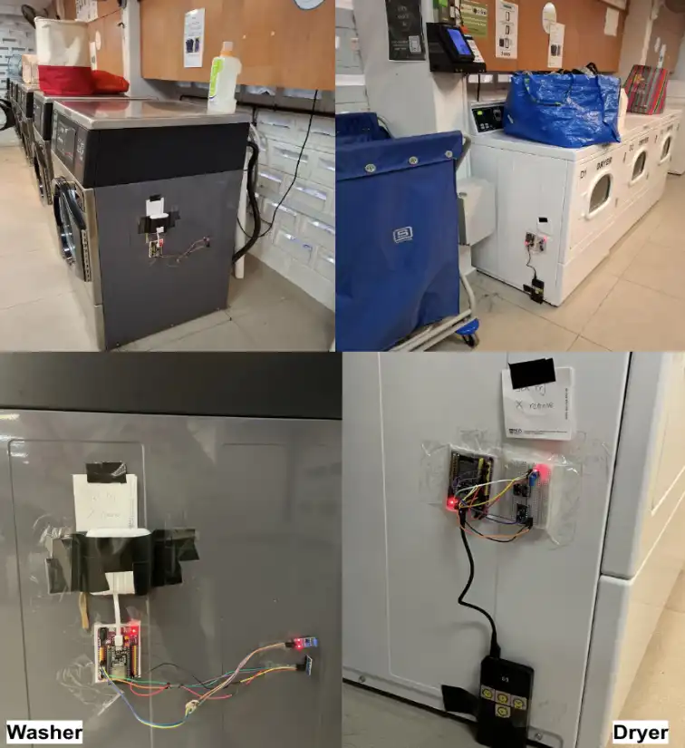
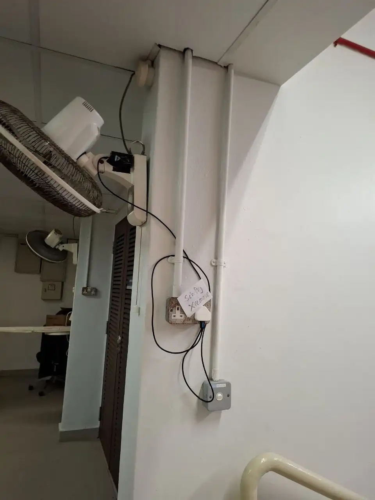
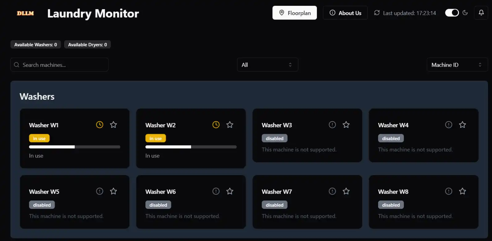
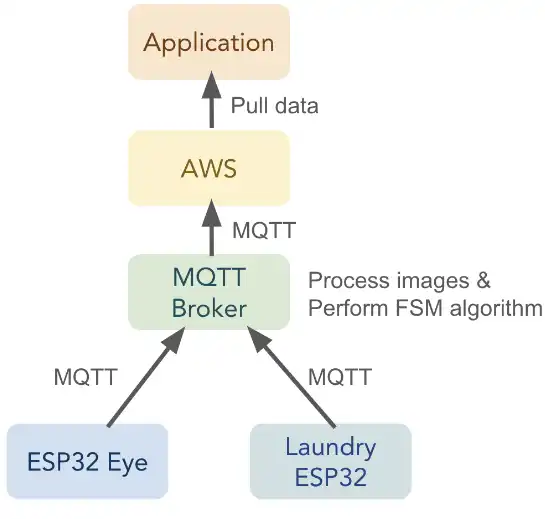
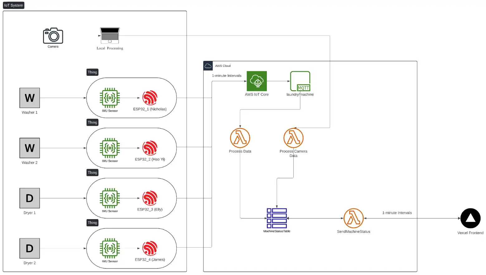
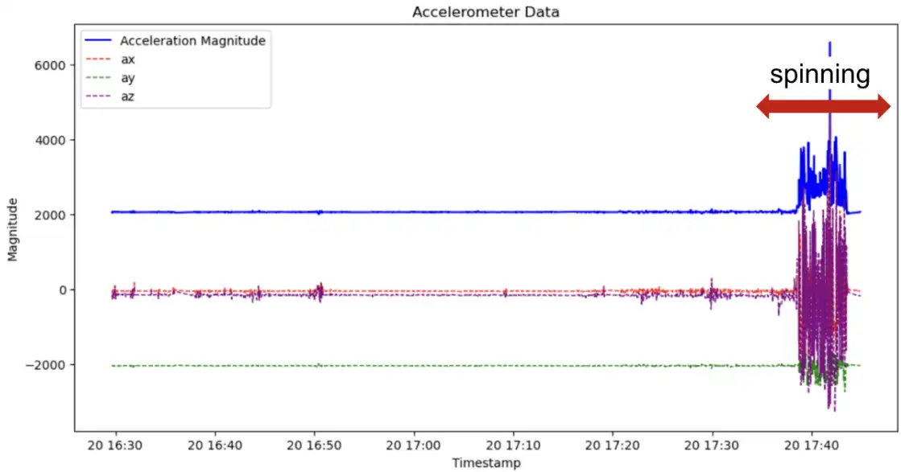
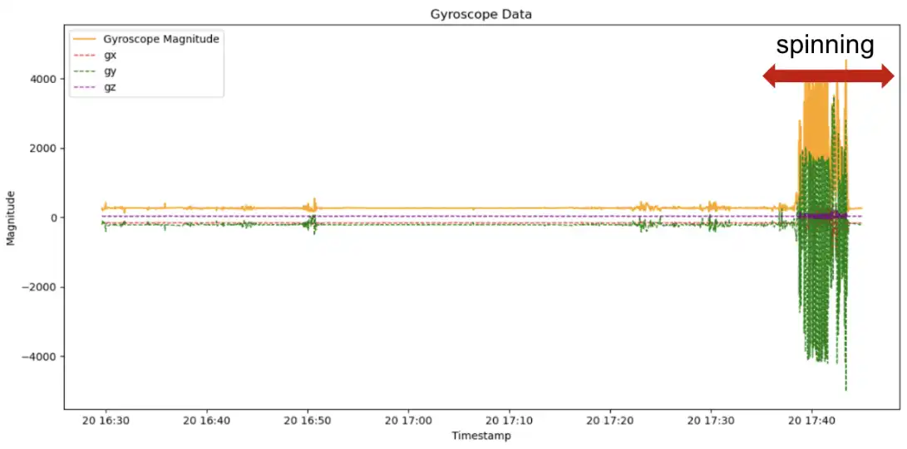
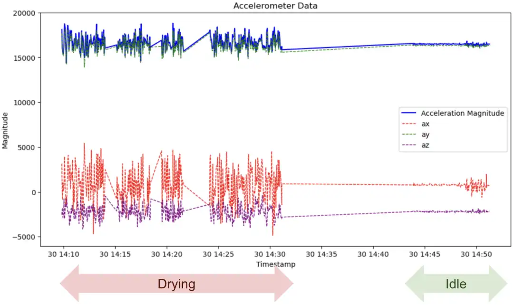
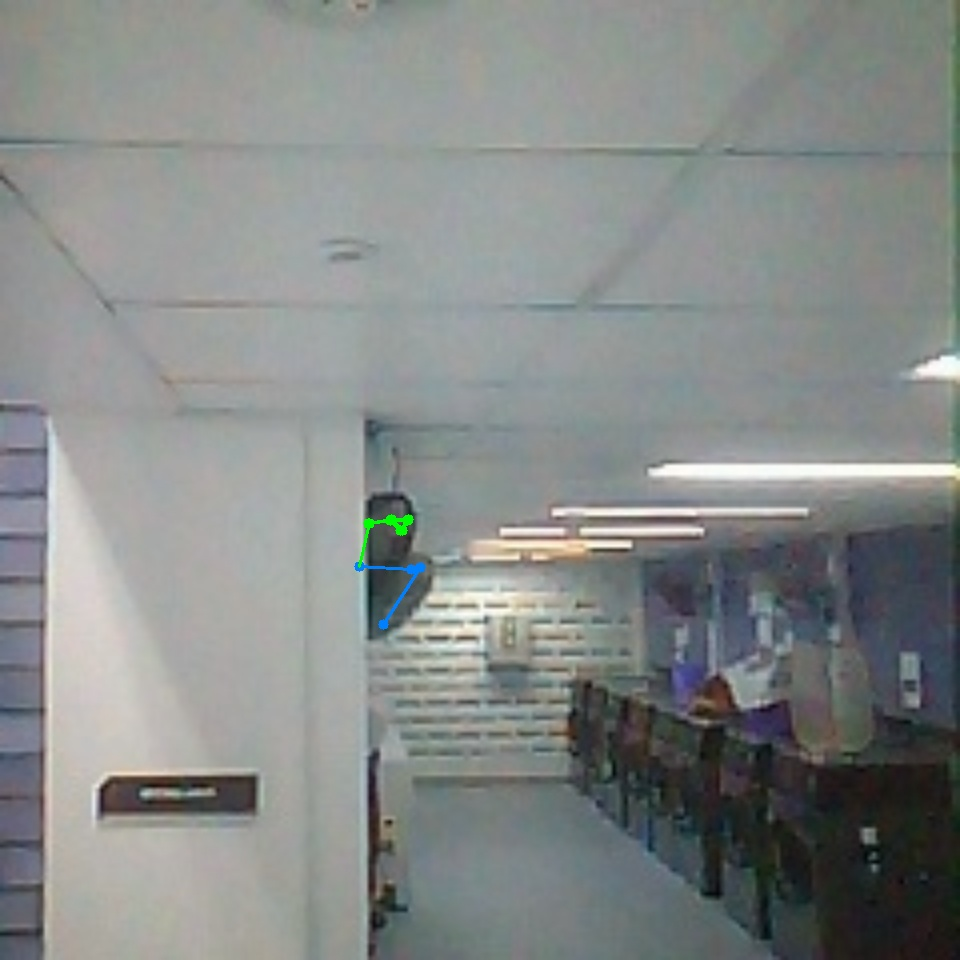
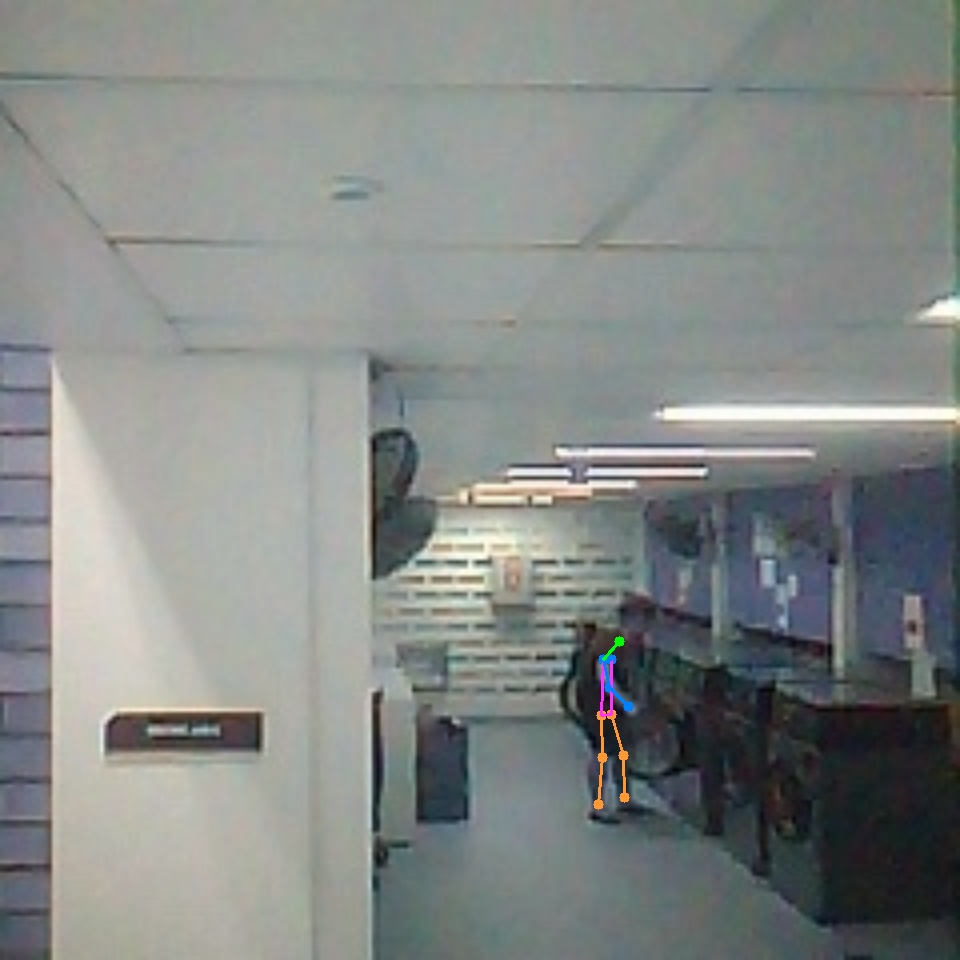

# Don't Leave Laundry Dirty (DLLM): An Open Source IoT Real-Time Laundry Monitoring System

This tutorial serves as a comprehensive guide to deploying and understanding DLLM, a real-time laundry management and monitoring solution. The project integrates IoT devices, machine learning algorithms, and a user-friendly web interface to streamline laundry usage in environments with limited laundry facilities.

## Introduction

DLLM aims to optimize laundry operations by automatically detecting machine availability and notifying users in real time. This solution alleviates the common inconveniences faced in residential settings, significantly reducing waiting times while maximizing machine utilization.

## Problem Statement

In residential communities with limited laundry facilities, users often struggle to find available machines, leading to frustration and wasted time. DLLM tackles this challenge by providing accurate, real-time machine status data, enabling better planning and an enhanced laundry experience.

## Key Objectives

1. Monitor machine occupancy using sensors and cameras.  
2. Automatically detect transitions between washing and drying cycles.  
3. Provide timely alerts and status updates through a web interface.  
4. Streamline interaction with laundry facilities to minimize unnecessary trips.

## System Overview

The system comprises:
- Washing machines and dryers with attached sensors.
- Cameras to capture user interactions. 
- A machine learning model to detect and classify tasks (e.g., loading and unloading). 
- A server-side component that processes data and communicates real-time status to a web application.

### How It Works

1. Sensors track machine cycles (spin, dry) while cameras capture user interactions.  
2. The data is processed by the machine learning model to determine machine availability.  
3. Status results are stored and forwarded to the software application.  
4. Residents access the web interface to view real-time machine availability and receive alerts.

## Getting Started

1. Assemble and install the necessary sensors and cameras on each machine.  
2. Configure your IoT modules for data collection and transmission.  
3. Deploy the machine learning model for occupancy detection.  
4. Launch the web application to present up-to-date machine statuses to users.

By following these steps, you can enable a more convenient and user-friendly laundry experience through precise tracking of machine availability and efficient notifications for all residents.

## About the Project & Team

This project is organized into several core components, each focusing on distinct aspects of data acquisition, processing, and overall system integration:

| Component      | Description               | Main Contributor               |
| -------------- | ------------------------- | ------------------------------ |
| Arduino        | Data collection and edge AI | Chao Yi-Ju                     |
| AWS            | Cloud integration and frontend | Nicholas Oh                    |
| ESP32          | Crowd detection and wireless communication | Cheah Hao Yi            |
| Task Detection | Pose analysis and task classification         | James Wong, Cheah Hao Yi |

## Setup

An Arduino-based sensor suite is securely mounted on the side of each laundry machine, as shown below:

The ESP32-S3-CAM is installed at an angle facing the machines for real-time user detection and data capture:

Positioned in front of each laundry unit, these modules detect user presence to refine machine status. Cameras capture frames and transmit presence data via HTTP POST requests to an AWS Lambda function (postCameraImageJSONFunction), which updates machine availability when user interaction is detected. This additional presence layer strengthens the reliability of the status display.

An MQTT broker is deployed to streamline communication between the Arduino, ESP32, and AWS cloud services, with source code in the [task detection folder](./task_detection/) and AWS configurations in the [aws folder](./aws/).

This project includes a web interface hosted on Vercel, as shown below:

The frontend queries a Lambda function (fetchMachineStatusFunction) every five minutes via HTTP GET requests to deliver real-time availability, ensuring status accuracy for all users.

Communication among the system components is depicted here:

All data is routed using MQTT to optimize resource utilization and enable frequent device updates. The ESP32 devices capture and preprocess sensor data, sending it to the broker for object detection. A Python script determines machine states based on the updated information, which is then published to AWS IoT Core. The application’s backend periodically pulls these statuses, displaying them on the frontend.

Below is the overall system architecture:

This scalable AWS-based infrastructure merges IoT hardware, cloud services, and machine learning models to offer real-time status monitoring and predictive insights. AWS IoT Core, Lambda, and DynamoDB handle data ingestion, computation, and storage. By adopting a pay-as-you-go model, AWS ensures efficiency and seamless scaling, while Terraform compatibility simplifies resource management and deployment consistency.

## Results

### Arduino
#### Washer Patterns
Additional IMU sensor data did not reveal distinct patterns for individual washing stages (wash, rinse, spin). Instead, readings mainly identified the washer’s spinning phase, which appears during the last ten minutes of each cycle. As shown in the graphs, only accelerometer and gyroscope magnitudes exhibit noticeable changes in that final period.

  

#### Dryer Patterns
Dryer sensor data indicated a clear trend for usage detection during spinning. The recorded acceleration values reliably signaled whether the dryer was active.  

The machine learning (ML) pipeline begins by labeling washer data as either “spinning” or “not spinning” and dryer data as “in use” or “not in use.” Data cleaning removes null values and outliers. Additional features, including accelerometer and gyroscope magnitudes, address varying IMU angles during manual installation. Models trained on acceleration alone showed comparable ~90% accuracy to multi-sensor inputs, so acceleration-based predictions were ultimately chosen.

For efficient deployment on the ESP32, the model remains lightweight. After hyperparameter tuning, a random forest classifier with n_estimators=20 and max_depth=4 was selected. The micromlgen library then converts the trained model into C++ code for direct integration onto the ESP32 device.

### ESP32
ESP32-EYE devices capture frames, compress them to JPG, and transmit them to the backend. Although lower image quality (~50%) yielded smaller file sizes (~4 KB), YOLOv7 inference performed inconsistently. To preserve detection accuracy, maximum quality (~20 KB per image) was adopted, trading size for more reliable people detection.

#### People Detection
An MQTT broker runs an open-source YOLOv7-based pose detection model (https://github.com/WongKinYiu/yolov7). Only frames containing people are stored and processed, with all output files deleted after project completion. 

During testing, YOLO occasionally produced false positives, indicating human poses where no person was present. The images below illustrate both an incorrect detection and a correctly identified pose:

To improve detection of actual loading and unloading activities, an additional model identifies whether a person is bending and facing a machine. This model also differentiates between washers and dryers to accurately capture when users are placing or removing laundry.

#### Decision Tree
Early implementations incorrectly flagged machine states when people were merely passing through the camera’s view. To address this, the system filters out standing or walking poses by checking the angles at shoulders, hips, and knees. Angles below 150 degrees indicate bending (machine use), while angles above 150 degrees represent standard upright positions.

Further classification occurs through a decision tree trained on head coordinates for bending poses. When someone is detected in a bent position, the tree predicts whether they are accessing a washer or dryer. The resulting classification updates the machine state displayed on the frontend.

## System Testing

The project's reliability was evaluated under diverse conditions to validate performance and robustness:

### Peak Usage Times
**Purpose:** Assess stability during high-demand hours.  
**Results:** Real-time status updates persisted without delays, and data caching resumed transmissions immediately after WiFi reconnects.

### Varied WiFi Strength
**Purpose:** Handle inconsistent connectivity in shared network environments.  
**Results:** Local caching prevented data loss during outages, while MQTT ensured stable and efficient updates following connection recovery.

### Simulated Faulty Sensor Installation
**Purpose:** Account for installation errors from various sensor angles.  
**Results:** Calibration and a magnitude feature minimized angle inconsistencies, enabling accurate machine tracking even under non-optimal sensor placement.

### Extended Operation for Power Efficiency
**Purpose:** Measure achievable battery life under continuous operation.  
**Results:** Configured duty cycles and RTOS scheduling allowed each ESP32 to exceed 100 hours of uninterrupted operation, ensuring low-maintenance deployment.

## Conclusion 
DLLM’s deployment highlights a successful integration of classroom knowledge with practical constraints, including inconsistent real-world data and networking conditions. By applying custom machine learning routines to address a widespread pain point in hostel settings, the project delivers tangible benefits that serve as a solid foundation for future IoT applications.

## Acknowledgement and References
We extend our deepest appreciation to:
- Professor Boyd Anderson and Professor Wang JingXian for their guidance and expertise.
- The contributors of the open-source [YOLOv7](https://github.com/WongKinYiu/yolov7) repository for providing valuable reference materials.

